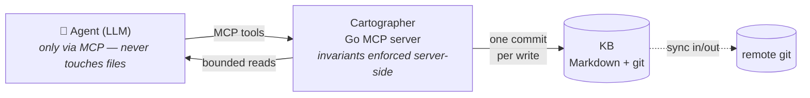

```
 ██████╗ █████╗ ██████╗ ████████╗ ██████╗  ██████╗ ██████╗  █████╗ ██████╗ ██╗  ██╗███████╗██████╗
██╔════╝██╔══██╗██╔══██╗╚══██╔══╝██╔═══██╗██╔════╝ ██╔══██╗██╔══██╗██╔══██╗██║  ██║██╔════╝██╔══██╗
██║     ███████║██████╔╝   ██║   ██║   ██║██║  ███╗██████╔╝███████║██████╔╝███████║█████╗  ██████╔╝
██║     ██╔══██║██╔══██╗   ██║   ██║   ██║██║   ██║██╔══██╗██╔══██║██╔═══╝ ██╔══██║██╔══╝  ██╔══██╗
╚██████╗██║  ██║██║  ██║   ██║   ╚██████╔╝╚██████╔╝██║  ██║██║  ██║██║     ██║  ██║███████╗██║  ██║
 ╚═════╝╚═╝  ╚═╝╚═╝  ╚═╝   ╚═╝    ╚═════╝  ╚═════╝ ╚═╝  ╚═╝╚═╝  ╚═╝╚═╝     ╚═╝  ╚═╝╚══════╝╚═╝  ╚═╝
```

> MCP governance server in **Go** for the *Agentic Wiki* — knowledge that **composes**, not that you query.

[](https://github.com/BeppeTemp/cartographer/actions/workflows/ci.yml)
[](https://github.com/BeppeTemp/cartographer/releases/latest)
[](https://goreportcard.com/report/github.com/BeppeTemp/cartographer)
[](LICENSE)
[](https://go.dev/)
[]()

> [!WARNING]
> **Beta software.** Cartographer is pre-1.0: the MCP tool surface, CLI and
> configuration may change between minor releases without a deprecation
> period. Breaking changes bump the **minor** version (0.x semantics) and are
> called out in the [changelog](CHANGELOG.md). Expect rough edges — bug
> reports are very welcome.

LLM agents forget everything between sessions, and stateless RAG only bolts retrieval onto that
amnesia. The alternative is a knowledge base the agent itself **builds and maintains over time** —
but letting an agent loose on a folder of files ends in broken links, lost history, and silent
corruption. **Cartographer** is the governance layer that makes the pattern safe: the agent works
the wiki exclusively through MCP tools, and the server enforces every invariant — validation,
linking, immutability gates, one git commit per write.


## What is it

**Cartographer** implements the _Agentic Wiki_: a persistent knowledge base of interlinked
Markdown files that an LLM agent grows and curates by talking to the server over the MCP
protocol. The agent **never touches the files directly**.

The wiki is grounded in **Karpathy's "LLM Wiki" pattern** (operating model: knowledge accretes
over time, it is not stateless RAG) on top of the **OKF** substrate (Open Knowledge Format v0.1 by
Google Cloud) — each KB is a folder of `.md` files with YAML frontmatter, self-contained and
version-controlled with git. Zero lock-in: the wiki is readable by any tool, including Obsidian and
any text editor.

Cartographer offers **two complementary profiles**:
- **Local Core** — single agent, stdio transport, local git. Captures the value of the pattern with
  minimal complexity.
- **Server** — multi-KB, HTTP + token auth, optional semantic embeddings. For shared and remote
  deployments.

## Key features

- 🔧 **Full MCP tool suite** — complete list in [`docs/control-plane.md`](docs/control-plane.md)
- 📖 **Read & navigation** — `kb_overview`, `concept_read`, `archive_list` / `dossier_list`,
  `graph_neighbors`
- 🔍 **Search** — keyword (pure-Go inverted index) plus optional hybrid semantic search via Ollama
- ✍️ **Validated writes** with optimistic concurrency (`if_match` / content-hash)
- 🛡️ **Governance** — deterministic `lint` (broken link, stale claim, orphan), `commit_gate`,
  `gate_check`, `supersede`, contradiction tracking
- 🧬 **Transactional git** — one commit per write operation; optional synchronization to a remote
  (fetch/pull-rebase before and push after every write) — git as a sync layer across multiple
  instances; agentic conflict handling (concepts flagged `degraded` + `conflicts_list` tool +
  guided skill)
- 🗂️ **Multi-KB** with `?kb=<name>` routing; bearer-token auth with scopes / RBAC
- 🔐 **Audit log** — append-only with hash-chain and Ed25519 signature
- 🧩 **Domain skills** (`SKILL.md` / agentskills.io format) with provisioning and client↔server sync
- 🔑 **Secrets via SOPS** — references only, plaintext values never stored
- ⚙️ **Multi-provider configurator** — generates MCP config for Claude Code, Codex CLI, Kiro,
  OpenCode
- 📦 **OKF-compliant** — each KB is an OKF bundle and a standalone git repo, zero lock-in (just git +
  Markdown)

## Architecture

Cartographer separates a **data plane** from a **control plane**:

- **Data plane** — the KB itself: OKF Markdown files under `data/`, organized as
  `archive → dossier → concept`. Plain files + git: history, diff, backup, sharing for free.
- **Control plane** — the MCP tools the agent calls. The server applies every invariant (validation,
  gates, immutability) so the agent operates safely without direct filesystem access.

The interaction rests on the **MCP + Skill + Hook** triad: MCP carries data and capabilities, Skills
carry procedural know-how loaded on demand, Hooks carry deterministic 0-token automation.



## Install

```bash
# macOS (Homebrew)
brew install beppetemp/tap/cartographer

# Linux / macOS without Homebrew
curl -fsSL https://raw.githubusercontent.com/BeppeTemp/cartographer/main/install.sh | sh

# From source (Go 1.26+)
go install github.com/BeppeTemp/cartographer/cmd/cartographer@latest
```

## Quick start

```bash
# Local stdio (Local Core)
cartographer serve --kb /path/to/kb --init

# HTTP multi-KB (Server profile, auth disabled)
CARTOGRAPHER_KB=/data/kb CARTOGRAPHER_HTTP=:8080 CARTOGRAPHER_AUTH=false \
  cartographer serve

# HTTP with auth
CARTOGRAPHER_KB=/data/kb CARTOGRAPHER_HTTP=:8080 CARTOGRAPHER_AUTH=true \
  CARTOGRAPHER_TOKENS=mytoken cartographer serve

# Local native service (launchd on macOS, systemd user unit on Linux)
cartographer service install   # generates config, installs and starts the service
cartographer service status    # exit 0 running / 3 stopped / 4 not installed

# Connect an agent client (Claude Code, OpenCode, Codex, Kiro) to a running server
cartographer connect
cartographer status   # drift check: exit 0 in-sync / 1 drift / 2 error
cartographer sync     # re-apply after drift
```

`connect` with no flags in a TTY opens an interactive form (server URL, server
name, token env var, auth) instead of the flag defaults; pass `--no-input` to
force the non-interactive behavior.

## Configuration

| Environment variable | Default | Description |
|---|---|---|
| `CARTOGRAPHER_KB` | — | KB path(s) (single, or multiple comma-separated) |
| `CARTOGRAPHER_DATA` | — | Directory whose subfolders are auto-discovered KBs |
| `CARTOGRAPHER_HTTP` | — | HTTP address (e.g. `:8080`). Absent = stdio only |
| `CARTOGRAPHER_AUTH` | auto | `true` / `false` / unset (auto on HTTP) |
| `CARTOGRAPHER_TOKENS` | — | Comma-separated bearer tokens |
| `CARTOGRAPHER_GIT_AUTOCOMMIT` | `true` | One git commit per write operation |
| `CARTOGRAPHER_GIT_SYNC` | `true` | fetch/pull-rebase + push on `origin` around each write |
| `CARTOGRAPHER_OLLAMA` | — | Ollama server URL for semantic search |
| `CARTOGRAPHER_OLLAMA_MODEL` | `nomic-embed-text` | Ollama embedding model |
| `CARTOGRAPHER_AUDIT_LOG` | — | Audit log file path |
| `CARTOGRAPHER_AUDIT_KEY` | — | Ed25519 key for audit signing |

Full list with CLI flags and defaults → [`docs/deployment.md`](docs/deployment.md).

## Building and testing

```bash
make build         # → bin/cartographer
make test          # Unit tests (go test ./...)
make smoke         # stdio smoke test
make smoke-http    # operator-level HTTP smoke test (creates temp KBs via curl)
make e2e           # agent-level E2E tests with headless OpenCode (9 scenarios)
make e2e-quick     # CRUD scenario only
```

The E2E harness drives **OpenCode in headless mode** as a real agent against a local server, using a
deliberately economical model as a clarity gate: if a cheap model can complete the mandates, the
system is clear enough for production. It needs an OpenAI-compatible endpoint
(`E2E_LLM_BASE_URL`); full strategy → [`docs/testing.md`](docs/testing.md).

## Project structure

```
cmd/
  cartographer/main.go      # Entry point: subcommand dispatch (serve/version/help/agents/connect/status/sync)
  cartographer/serve.go     # Server: flags + env vars + YAML config, stdio/HTTP
  cartographer/tui.go       # Interactive dashboard (no-args, TTY)
internal/
  config/                   # Server YAML config (flag > env > YAML > default)
  okf/                      # OKF primitives: ConceptID, frontmatter, content-hash
  kb/                       # Data plane: Open, Init, Read/WriteConcept, Validate
  kb/graph.go               # Graph navigation: ExtractLinks, GraphNeighbors
  kb/gate.go                # CommitGate
  kb/gitsync.go             # Transactional git: lock, commit, sync in/out
  kb/conflicts.go           # Conflict registry, MarkDegraded
  mcpserver/                # MCP server: stdio, HTTP handler, MultiKBServer, tools (split by domain)
  mcpserver/gitwrap.go      # Write wrapper: lock + commit + sync
  search/                   # Pure-Go inverted index
  sqlindex/                 # Persisted SQLite index: FTS5 trigram + embedding cache
  lint/                     # Deterministic lint
  gitx/                     # git wrapper: commit, rebase, push, fetch, stash
  audit/                    # Audit log: JSONL hash-chain + Ed25519
  auth/                     # TokenStore, middleware, RBAC, scopes
  embed/                    # Embedder interface + Ollama adapter + vector store
  skill/                    # SKILL.md loader and validator (agentskills.io)
  sops/                     # SOPS decryption wrapper
  configurator/             # Multi-provider adapters, HTTP-only (Claude Code, Codex, Kiro, OpenCode)
  provisioning/             # Manifest, lock (v1/v2 multi-provider), diff, apply — client↔server sync
  agents/                   # Detect() installed agent CLIs on this machine
  clientconfig/             # .cartographer.yaml (server URL, connected agents)
  client/                   # Minimal MCP client (JSON-RPC over HTTP) for the client subcommands
docs/                       # Full documentation (see docs/index.md)
test/e2e/                   # Agent-level E2E harness
```

## Documentation

The full index lives in [`docs/index.md`](docs/index.md). Main entry points:

- [`docs/overview.md`](docs/overview.md) — vision, guiding principles, architecture
- [`docs/data-plane.md`](docs/data-plane.md) — KB model, hierarchy, OKF
- [`docs/control-plane.md`](docs/control-plane.md) — Go server, MCP tool API
- [`docs/concurrency.md`](docs/concurrency.md) — single-writer, git sync, conflicts
- [`docs/deployment.md`](docs/deployment.md) — topologies (local service / k8s / multi-server), backup, env vars

## Contributing

Issues and PRs are welcome — see [`CONTRIBUTING.md`](CONTRIBUTING.md) for the build/test loop, the
PR flow (squash-merge, conventional titles, docs updated in the same PR), and how to find your way
around the codebase. Cartographer is a personal project maintained on a best-effort basis: no
response-time SLA. For security reports, see [`SECURITY.md`](SECURITY.md).

## License

Released under the Apache License 2.0. See [`LICENSE`](LICENSE).
