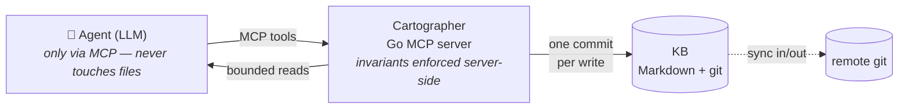

```
 ██████╗ █████╗ ██████╗ ████████╗ ██████╗  ██████╗ ██████╗  █████╗ ██████╗ ██╗  ██╗███████╗██████╗
██╔════╝██╔══██╗██╔══██╗╚══██╔══╝██╔═══██╗██╔════╝ ██╔══██╗██╔══██╗██╔══██╗██║  ██║██╔════╝██╔══██╗
██║     ███████║██████╔╝   ██║   ██║   ██║██║  ███╗██████╔╝███████║██████╔╝███████║█████╗  ██████╔╝
██║     ██╔══██║██╔══██╗   ██║   ██║   ██║██║   ██║██╔══██╗██╔══██║██╔═══╝ ██╔══██║██╔══╝  ██╔══██╗
╚██████╗██║  ██║██║  ██║   ██║   ╚██████╔╝╚██████╔╝██║  ██║██║  ██║██║     ██║  ██║███████╗██║  ██║
 ╚═════╝╚═╝  ╚═╝╚═╝  ╚═╝   ╚═╝    ╚═════╝  ╚═════╝ ╚═╝  ╚═╝╚═╝  ╚═╝╚═╝     ╚═╝  ╚═╝╚══════╝╚═╝  ╚═╝
```

> MCP governance server in **Go** for the *Agentic Wiki* — knowledge that **composes**, not that you query.

[](https://github.com/BeppeTemp/cartographer/actions/workflows/ci.yml)
[](https://github.com/BeppeTemp/cartographer/releases)
[](https://goreportcard.com/report/github.com/BeppeTemp/cartographer)
[](LICENSE)
[](https://go.dev/)
[](https://modelcontextprotocol.io/)

> [!WARNING]
> **Beta software.** Cartographer is pre-1.0: the MCP tool surface, CLI and
> configuration may change between minor releases without a deprecation
> period. Breaking changes bump the **minor** version (0.x semantics) and are
> called out in the [changelog](CHANGELOG.md). Expect rough edges — bug
> reports are very welcome.

LLM agents forget everything between sessions, and stateless RAG only bolts retrieval onto that
amnesia. The alternative is a knowledge base the agent itself **builds and maintains over time** —
but letting an agent loose on a folder of files ends in broken links, lost history, and silent
corruption. **Cartographer** is the governance layer that makes the pattern safe: the agent works
the wiki exclusively through MCP tools, and the server enforces every invariant — validation,
linking, immutability gates, one git commit per write.

## What is it

**Cartographer** implements the _Agentic Wiki_: a persistent knowledge base of interlinked
Markdown files that an LLM agent grows and curates by talking to the server over the MCP
protocol. The agent **never touches the files directly**.

The wiki is grounded in **Karpathy's "LLM Wiki" pattern** (operating model: knowledge accretes
over time, it is not stateless RAG) on top of the **OKF** substrate (Open Knowledge Format v0.1 by
Google Cloud) — each KB is a folder of `.md` files with YAML frontmatter, self-contained and
version-controlled with git. Zero lock-in: the wiki is readable by any tool, including Obsidian and
any text editor.

One binary, two transports — deployment choices, not separate products: the KB model and the MCP
tools are the same on both.
- **Local stdio** — one client, one KB, no network. The simplest way to run the pattern.
- **HTTP server** — one or more KBs behind bearer-token auth, as a native user service, a container
  or a Kubernetes workload. It hands each client the artifacts its KBs define, and lets a team
  share some KBs while keeping others private.

Two consequences are worth stating on their own, because they are what most of the design is for:
the KB **configures the agents that read it** across every client you use, and it does that for a
whole team rather than a single laptop.

## Quick start

You need **git** and an **empty git repository** you own (GitHub, Gitea, any git host) to be your
first KB's remote: a KB *is* a git repository, and that remote is what makes it durable and
syncable. `sops` in `PATH` is needed only if the KB will hold encrypted values.

```bash
brew install beppetemp/tap/cartographer                  # or install.sh / go install — see Install
cartographer service install                             # generates the config, installs and starts the service
cartographer kb create <name> --remote <url> --restart   # scaffolds a KB, pushes it to <url>, restarts the service
cartographer connect                                     # configures every detected agent client
```

A repository that already holds a KB is mounted with `cartographer kb clone <remote>` instead;
`--no-remote` creates a local-only KB that is neither backed up nor synced. `connect` in a TTY
opens an interactive form (server URL, server name, token env var, auth); `--no-input` forces the
flag defaults. Agent sessions that were already open need a restart to see the new MCP server.

Once connected:

```bash
cartographer status    # drift check and client/server version check; exit 0 in-sync / 1 drift / 2 error
cartographer sync      # re-apply after drift
cartographer doctor    # read-only diagnosis of the client configuration: residues, drift, missing triggers
cartographer reconnect # rebuild a client configuration from scratch, preserving every setting
```

The step-by-step walkthrough is [`docs/getting-started.md`](docs/getting-started.md). For a single
KB over stdio with no service (typically development) or a hand-configured HTTP server, see `serve`
in [`docs/deployment.md`](docs/deployment.md).

### Installing Cartographer with an agent

The Quick start assumes an **interactive operator** who answers the prompts and diagnoses a failure
as it happens.

**If you are an agent and the user has asked you to install Cartographer**: fetch
<https://raw.githubusercontent.com/BeppeTemp/cartographer/main/docs/agent-install.md>
and follow it command by command. Do **not** install from the Quick start above: the runbook asks
for the KB remote up front, verifies the install and ends with the session restart you cannot
perform yourself.

For a human driving an agent, this is the prompt to paste:

```text
Set up Cartographer on this machine by following
https://raw.githubusercontent.com/BeppeTemp/cartographer/main/docs/agent-install.md
My first knowledge base is at: `<git remote URL>`
```

## One KB, every agent

A knowledge base is not only what an agent reads — it is also **how that agent is set up to work**.
Cartographer treats skills, subagents, hooks and standing instructions as content of the KB, and
materializes them into each client's native format.

The manual alternative is what most setups do today: the same skill hand-copied into
`.claude/skills/`, `.opencode/skills/` and `.codex/skills/`, each drifting on its own, each config
file edited by hand for every MCP endpoint. Change one thing and you change it in six places, on
every machine, forever.

```bash
cartographer connect        # detects installed clients and configures all of them
```

That single command writes, per client and in the format that client expects:

| | claude | opencode | codex | kiro | antigravity | hermes |
|---|---|---|---|---|---|---|
| **MCP endpoint** | `~/.claude.json` | `~/opencode.json` | block in `~/.codex/config.toml` | `~/.kiro/settings/mcp.json` | `~/.gemini/config/mcp_config.json` | — |
| **Instructions** | block in `~/.claude/CLAUDE.md` | block in `~/.config/opencode/AGENTS.md` | block in `~/.codex/AGENTS.md` | `~/.kiro/steering/cartographer.md` | block in `~/.gemini/GEMINI.md` | — |
| **Skills** | `~/.claude/skills/` | `~/.opencode/skills/` | `~/.codex/skills/` | `~/.kiro/skills/` | `~/.gemini/config/skills/` | delivered to its inbox |
| **Subagents** | `~/.claude/agents/*.md` | `~/.opencode/agent/*.md` | `~/.codex/agents/*.toml` | `~/.kiro/agents/*.json` | `~/.gemini/config/agents/*.md` | — |
| **Hooks** | `~/.claude/hooks/`, registered in `settings.json` | `~/.opencode/hooks/`, run by a generated JS plugin | `~/.codex/hooks/`, registered in `config.toml` | — | `~/.gemini/config/hooks/`, registered in `hooks.json` | — |
| **Re-sync trigger** | `SessionStart` hook | `SessionStart` hook | `SessionStart` hook | scheduled timer | scheduled timer | scheduled timer |

Subagents and hooks are **translated**, not copied: the same KB artifact becomes a Markdown agent
for Claude Code, a TOML one for Codex, Antigravity-native Markdown, and a generated JavaScript
plugin where a hook has no declarative equivalent.

Every `—` is an `unsupported` cell **declared for a stated reason**, never a silent omission — and a
cell missing from the table fails a test:

- **kiro** — the shipped client has no hook mechanism that actually fires (verified empirically;
  details in [`docs/interoperability.md`](docs/interoperability.md) §Kiro hooks), so its re-sync
  trigger is the scheduled timer. Subagents work: `~/.kiro/agents/<name>.json` is discovered
  globally and the built-in agent delegates to it by description.
- **hermes** — its MCP endpoints and its always-on instruction slot are rendered by its own Ansible
  role and recreated on the next playbook run, and it has no subagent directory and no hook engine.
  Skills are *delivered*, not installed: they land in an inbox with a generated `SOURCE.md` and the
  agent's own curator adopts them, because overwriting what that curator owns would destroy its
  learning.

Where there is no session hook, the **scheduled trigger** takes over
(`cartographer service sync-timer install`): opt-in, explicit, and never installed as a side effect
of connecting.

What keeps it true after the first run:

- **it re-syncs by itself** — a `SessionStart` hook on every client that has one, a scheduled timer
  for those that don't;
- **it verifies the files on disk**, not just its own bookkeeping: an artifact edited by hand or
  deleted is restored from the server;
- **every materialized file carries a provenance stamp** saying which KB it came from and where to
  edit it for real;
- **it only ever touches what it created** — pruning is limited to its own tracked paths, and
  `--dry-run` shows the plan without writing;
- **`doctor`** diagnoses residues and drift read-only; **`reconnect`** rebuilds a client from
  scratch while preserving every setting.

Edit a skill once in the KB, and every client of every machine converges on it.

## Teams

The same mechanism is what makes Cartographer work for more than one person. A server mounts
several KBs, each on its own endpoint (`/mcp/<name>` or `?kb=<name>`), so colleagues can each keep
a private knowledge base while sharing others. With `mcp.mount_mode: routed` the server also exposes
a single `/mcp/routed` surface where the KB is a tool argument: a client using several KBs then
carries one copy of the tool schemas instead of one per KB.

- **Per-KB authorization** — bearer tokens carry `kb:<name>:r` or `kb:<name>:rw` scopes. **Roles**
  ([`docs/transport-auth.md`](docs/transport-auth.md)) narrow that further to specific maps, journals
  and concept types, so a teammate can be an editor of the runbooks and a reader of everything else.
  Rules are unioned: adding a role can only widen access, never silently revoke it.
- **Git is the sync layer** — every write is a commit, with fetch/pull-rebase before and push after,
  so teammates running their own server against **separate clones of the same remote** converge
  without a coordination protocol. A conflict is then not an error page but a workflow: the affected
  concepts are flagged `degraded`, `conflicts_list` enumerates them, and a bundled skill walks an
  agent through resolving them. (One process is the sole writer of a given working copy; pointing
  two writers at one checkout is not a supported model — partition KBs across instances instead, see
  [`docs/concurrency.md`](docs/concurrency.md).)
- **Shared content stays portable** — a skill that mentions a local repository uses a
  `{{repo:<name>}}` placeholder resolved **on each client** from its own git remotes, so the same
  artifact works on every teammate's machine without machine-specific paths leaking into the KB. A
  server-side lint flags the ones that do.
- **Provenance you can verify** — a KB can sign its provisioning artifacts with Ed25519; clients pin
  the public key out of band and refuse anything that fails verification. Distributing a skill to a
  team is then a checkable act, not a matter of trust.
- **Per-KB identity** — the commit author is configured per KB, so history attributes correctly; on
  per-KB endpoints an optional tool-name prefix keeps an agent mounting several KBs from confusing
  their tools (the routed surface needs none: the KB is a call argument).

## Key features

- 🔧 **Full MCP tool suite** — complete list in [`docs/control-plane.md`](docs/control-plane.md)
- 📖 **Read & navigation** — `atlas_overview`, `index_get`, `concept_read`, `map_list`,
  `graph_neighbors` (outbound links or backlinks) and `concept_list` (scoped frontmatter facets)
- 🔍 **Search** — keyword: a pure-Go inverted index, or SQLite FTS5 with a trigram tokenizer when
  the KB has a persisted index
- ✍️ **Validated writes** with optimistic concurrency (`if_match` / content-hash), including
  `concept_new` from KB-owned templates discovered through `template_list`
- ✂️ **Bounded edits and batches** — `concept_patch` and `index_patch` apply Edit-like patches to a
  concept or a curated `index.md`; `concept_batch` makes a large refactor atomic across many
  concepts (one commit, full rollback on any failure)
- 📎 **Concept assets** — read, write, list, and delete binary or text dossier files inside expanded
  concepts
- 🛡️ **Governance** — deterministic `lint` (broken link, stale claim, orphan, map contracts),
  `gate_check` (validation + lint + commit gate in one call), `supersede`, contradiction tracking
- 🧬 **Transactional git** — one commit per write operation; optional synchronization to a remote
  (fetch/pull-rebase before and push after every write), which is also what lets several instances
  serve one KB — see [Teams](#teams)
- 🔐 **Audit log** — append-only with hash-chain and Ed25519 signature
- 🧩 **Domain skills** (`SKILL.md` / agentskills.io format), including executable scripts and binary
  assets — see [One KB, every agent](#one-kb-every-agent) for how they reach each client
- 🔑 **Secrets via SOPS** — JSON Pointer references, scoped resolution and safe rotation; plaintext
  values never stored
- 📦 **OKF-compliant** — each KB is an OKF bundle and a standalone git repo, zero lock-in (just git +
  Markdown)

## Architecture

Cartographer separates a **data plane** from a **control plane**:

- **Data plane** — the KB itself: OKF Markdown files under `data/`, organized as
  **atlas → map → concept** (the KB, its thematic archives, the pages; journals are the
  chronological maps). Plain files + git: history, diff, backup, sharing for free.
- **Control plane** — the MCP tools the agent calls. The server applies every invariant (validation,
  gates, immutability) so the agent operates safely without direct filesystem access.

The interaction rests on the **MCP + Skill + Hook** triad: MCP carries data and capabilities, Skills
carry procedural know-how loaded on demand, Hooks carry deterministic 0-token automation.


```mermaid
flowchart LR
    A["🤖 Agent (LLM)<br/><i>only via MCP — never touches files</i>"]
    S["Cartographer<br/>Go MCP server<br/><i>invariants enforced server-side</i>"]
    KB[("KB<br/>Markdown + git")]
    R[("remote git")]
    A -- "MCP tools" --> S
    S -- "bounded reads" --> A
    S -- "one commit<br/>per write" --> KB
    KB -. "sync in/out" .-> R
```

## Install

```bash
# macOS (Homebrew)
brew install beppetemp/tap/cartographer

# Linux / macOS without Homebrew (Darwin and Linux only)
curl -fsSL https://raw.githubusercontent.com/BeppeTemp/cartographer/main/install.sh | sh

# From source (Go 1.26+)
go install github.com/BeppeTemp/cartographer/cmd/cartographer@latest
```

### What gets installed

- **The binary**, `cartographer` — in Homebrew's prefix (`brew`), in
  `/usr/local/bin` or, when that is not writable, `~/.local/bin` (`install.sh`),
  or in `$GOBIN`/`$GOPATH/bin` (`go install`).
- **A native per-user service**, if you run `cartographer service install`:
  `~/Library/LaunchAgents/com.cartographer.serve.plist` on macOS, or
  `~/.config/systemd/user/cartographer.service` on Linux, listening on
  `127.0.0.1:39273`. Its config is generated at
  `~/.config/cartographer/server.yaml`. The service is **optional** — a
  stdio-only setup (`serve --kb <path>`) is a legitimate topology and installs
  none of this.
- **A data directory**, `~/cartographer-data` by default, holding the cloned KBs.
- **Writes into your agent clients' own configuration** under `$HOME`, and only
  when you run `cartographer connect` — never before. Each destination path is
  listed in the [One KB, every agent](#one-kb-every-agent) matrix above. A sync
  timer (`com.cartographer.sync` / `cartographer-sync.timer`) is installed for
  clients that have no session-start hook.

### Upgrades

Upgrades of a native local install (`brew upgrade` or `install.sh update`) repair themselves: the
new binary restarts the running service and re-synchronizes the configured providers in place.
`cartographer reconnect` is the explicit rebuild for what an incremental sync cannot see. Only
already-open agent sessions need restarting. Details →
[`docs/deployment.md`](docs/deployment.md) §Upgrades, schema migration, and repo growth.

### How to remove it

`install.sh uninstall` removes the **binary only**. It refuses to run while the
native units are still installed, and names the teardown that has to come first:

```bash
cartographer disconnect                      # removes what was materialized into your agents
cartographer service sync-timer uninstall
cartographer service uninstall
curl -fsSL https://raw.githubusercontent.com/BeppeTemp/cartographer/main/install.sh | sh -s -- uninstall
```

Your KBs are git repositories in the data directory: nothing above deletes them,
and removing `~/cartographer-data` is a deliberate, separate act.

## Configuration

The server reads a YAML file — `cartographer service install` generates
`~/.config/cartographer/server.yaml`, and [`config.example.yaml`](config.example.yaml) is the
annotated example. Environment variables and CLI flags override it (flag > env > YAML > default). The ones
most often set:

| Environment variable | Default | Description |
|---|---|---|
| `CARTOGRAPHER_CONFIG` | — | Path to the YAML config file |
| `CARTOGRAPHER_KB` | — | KB path(s) (single, or multiple comma-separated) |
| `CARTOGRAPHER_DATA` | — | Directory whose subfolders are auto-discovered KBs |
| `CARTOGRAPHER_HTTP` | — | HTTP address (e.g. `:39273`). Absent = stdio only |
| `CARTOGRAPHER_AUTH` | auto | `true` / `false` / unset (auto on HTTP) |
| `CARTOGRAPHER_TOKENS` | — | Comma-separated bearer tokens |
| `CARTOGRAPHER_GIT_SYNC` | `true` | fetch/pull-rebase + push on `origin` around each write |
| `CARTOGRAPHER_TOOLS_PROFILE` | `agent` | `agent` lists only the agent's core tools; `full` lists all (hidden ones stay callable) |
| `CARTOGRAPHER_MCP_MOUNT_MODE` | `per-kb` | `routed` adds the single `/mcp/routed` surface for all KBs |

Full list with CLI flags and defaults → [`docs/deployment.md`](docs/deployment.md).

## Building and testing

```bash
make build         # → bin/cartographer
make test          # Unit tests (go test ./...)
make smoke         # stdio smoke test
make smoke-http    # operator-level HTTP smoke test (creates temp KBs via curl)
make e2e           # deterministic HTTP/CLI end-to-end scenarios
```

The E2E suite drives the compiled binary through HTTP, CLI, filesystem and real
temporary git remotes. It is deterministic, requires no model credentials and
runs in CI. Full strategy → [`docs/testing.md`](docs/testing.md).

## Project structure

```
cmd/cartographer/   # single binary: server (serve), client (connect/status/sync/kb/service), TUI
internal/           # one package per concern: KB model, MCP server, search, git, auth, provisioning, …
docs/               # full documentation (docs/index.md is the map)
test/               # deterministic HTTP smoke and cross-component E2E tests
```

Package-by-package map, with what each one owns → [`AGENTS.md`](AGENTS.md) §Code map (kept next to
the contributor instructions so there is a single copy to keep true).

## Documentation

Browsable at **[beppetemp.github.io/cartographer](https://beppetemp.github.io/cartographer/)** — same content as `docs/`, rendered.

The full index lives in [`docs/index.md`](docs/index.md). Main entry points:

- [`docs/getting-started.md`](docs/getting-started.md) — from zero to a working wiki, step by step
- [`docs/overview.md`](docs/overview.md) — vision, guiding principles, architecture
- [`docs/data-plane.md`](docs/data-plane.md) — KB model, hierarchy, OKF
- [`docs/control-plane.md`](docs/control-plane.md) — Go server, MCP tool API
- [`docs/concurrency.md`](docs/concurrency.md) — single-writer, git sync, conflicts
- [`docs/deployment.md`](docs/deployment.md) — topologies (local service / k8s / multi-server), backup, env vars

## Contributing

Issues and PRs are welcome — see [`CONTRIBUTING.md`](CONTRIBUTING.md) for the build/test loop, the
PR flow (squash-merge, conventional titles, docs updated in the same PR), and how to find your way
around the codebase. Cartographer is a personal project maintained on a best-effort basis: no
response-time SLA. For security reports, see [`SECURITY.md`](SECURITY.md).

## License

Released under the Apache License 2.0. See [`LICENSE`](LICENSE).
