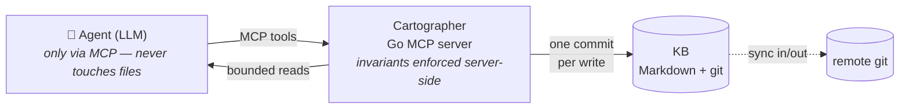

```
 ██████╗ █████╗ ██████╗ ████████╗ ██████╗  ██████╗ ██████╗  █████╗ ██████╗ ██╗  ██╗███████╗██████╗
██╔════╝██╔══██╗██╔══██╗╚══██╔══╝██╔═══██╗██╔════╝ ██╔══██╗██╔══██╗██╔══██╗██║  ██║██╔════╝██╔══██╗
██║     ███████║██████╔╝   ██║   ██║   ██║██║  ███╗██████╔╝███████║██████╔╝███████║█████╗  ██████╔╝
██║     ██╔══██║██╔══██╗   ██║   ██║   ██║██║   ██║██╔══██╗██╔══██║██╔═══╝ ██╔══██║██╔══╝  ██╔══██╗
╚██████╗██║  ██║██║  ██║   ██║   ╚██████╔╝╚██████╔╝██║  ██║██║  ██║██║     ██║  ██║███████╗██║  ██║
 ╚═════╝╚═╝  ╚═╝╚═╝  ╚═╝   ╚═╝    ╚═════╝  ╚═════╝ ╚═╝  ╚═╝╚═╝  ╚═╝╚═╝     ╚═╝  ╚═╝╚══════╝╚═╝  ╚═╝
```

> MCP governance server in **Go** for the *Agentic Wiki* — knowledge that **composes**, not that you query.

[](https://github.com/BeppeTemp/cartographer/actions/workflows/ci.yml)
[](https://github.com/BeppeTemp/cartographer/releases)
[](https://goreportcard.com/report/github.com/BeppeTemp/cartographer)
[](LICENSE)
[](https://go.dev/)
[]()

> [!WARNING]
> **Beta software.** Cartographer is pre-1.0: the MCP tool surface, CLI and
> configuration may change between minor releases without a deprecation
> period. Breaking changes bump the **minor** version (0.x semantics) and are
> called out in the [changelog](CHANGELOG.md). Expect rough edges — bug
> reports are very welcome.

LLM agents forget everything between sessions, and stateless RAG only bolts retrieval onto that
amnesia. The alternative is a knowledge base the agent itself **builds and maintains over time** —
but letting an agent loose on a folder of files ends in broken links, lost history, and silent
corruption. **Cartographer** is the governance layer that makes the pattern safe: the agent works
the wiki exclusively through MCP tools, and the server enforces every invariant — validation,
linking, immutability gates, one git commit per write.


## What is it

**Cartographer** implements the _Agentic Wiki_: a persistent knowledge base of interlinked
Markdown files that an LLM agent grows and curates by talking to the server over the MCP
protocol. The agent **never touches the files directly**.

The wiki is grounded in **Karpathy's "LLM Wiki" pattern** (operating model: knowledge accretes
over time, it is not stateless RAG) on top of the **OKF** substrate (Open Knowledge Format v0.1 by
Google Cloud) — each KB is a folder of `.md` files with YAML frontmatter, self-contained and
version-controlled with git. Zero lock-in: the wiki is readable by any tool, including Obsidian and
any text editor.

Cartographer offers **two complementary profiles**:
- **Local Core** — single agent, stdio transport, local git. Captures the value of the pattern with
  minimal complexity.
- **Server** — multi-KB, HTTP + token auth. One server holds several knowledge bases, hands each
  client the artifacts its KBs define, and lets a team share some KBs while keeping others private.

Two consequences are worth stating on their own, because they are what most of the design is for:
the KB **configures the agents that read it** across every client you use, and it does that for a
whole team rather than a single laptop.

## One KB, every agent

A knowledge base is not only what an agent reads — it is also **how that agent is set up to work**.
Cartographer treats skills, subagents, hooks and standing instructions as content of the KB, and
materializes them into each client's native format.

The manual alternative is what most setups do today: the same skill hand-copied into
`.claude/skills/`, `.opencode/skills/` and `.codex/skills/`, each drifting on its own, each config
file edited by hand for every MCP endpoint. Change one thing and you change it in five places, on
every machine, forever.

```bash
cartographer connect        # detects installed clients and configures all of them
```

That single command writes, per client and in the format that client expects:

| | claude | opencode | codex | kiro | hermes |
|---|---|---|---|---|---|
| **MCP endpoint** | `.claude.json` | `opencode.json` | `config.toml` block | `.kiro/settings/mcp.json` | *rendered by its own deploy* |
| **Skills** | `.claude/skills/` | `.opencode/skills/` | `.codex/skills/` | `.kiro/skills/` | delivered to its inbox |
| **Subagents** | `.claude/agents/*.md` | `.opencode/agent/*.md` | `.codex/agents/*.toml` | — | — |
| **Hooks** | `settings.json` | generated JS plugin | `config.toml` block | — | — |
| **Instructions** | block in `CLAUDE.md` | block in `AGENTS.md` | block in `AGENTS.md` | `.kiro/steering/` | — |

Subagents and hooks are **translated**, not copied: the same KB artifact becomes a Markdown agent
for Claude Code, a TOML one for Codex, and a generated JavaScript plugin where a hook has no native
equivalent. Cells that cannot exist are `unsupported` by explicit declaration, never by silent
omission — and a cell missing from the table fails a test.

What keeps it true after the first run:

- **it re-syncs by itself** — a `SessionStart` hook on every client that has one, a scheduled timer
  for those that don't;
- **it verifies the files on disk**, not just its own bookkeeping: an artifact edited by hand or
  deleted is restored from the server;
- **every materialized file carries a provenance stamp** saying which KB it came from and where to
  edit it for real;
- **it only ever touches what it created** — pruning is limited to its own tracked paths, and
  `--dry-run` shows the plan without writing;
- **`doctor`** diagnoses residues and drift read-only; **`reconnect`** rebuilds a client from
  scratch while preserving every setting.

Edit a skill once in the KB, and every client of every machine converges on it.

## Teams

The same mechanism is what makes Cartographer work for more than one person. A server mounts
several KBs and routes by `?kb=<name>`, so colleagues can each keep a private knowledge base while
sharing others.

- **Per-KB authorization** — bearer tokens carry `kb:<name>:r` or `kb:<name>:rw` scopes. **Roles**
  ([`docs/transport-auth.md`](docs/transport-auth.md)) narrow that further to specific maps, journals
  and concept types, so a teammate can be an editor of the runbooks and a reader of everything else.
  Rules are unioned: adding a role can only widen access, never silently revoke it.
- **Git is the sync layer** — every write is a commit, with fetch/pull-rebase before and push after,
  so teammates running their own server against **separate clones of the same remote** converge
  without a coordination protocol. A conflict is then not an error page but a workflow: the affected
  concepts are flagged `degraded`, `conflicts_list` enumerates them, and a bundled skill walks an
  agent through resolving them. (One process is the sole writer of a given working copy; pointing
  two writers at one checkout is not a supported model — partition KBs across instances instead, see
  [`docs/concurrency.md`](docs/concurrency.md).)
- **Shared content stays portable** — a skill that mentions a local repository uses a
  `{{repo:<name>}}` placeholder resolved **on each client** from its own git remotes, so the same
  artifact works on every teammate's machine without machine-specific paths leaking into the KB. A
  server-side lint flags the ones that do.
- **Provenance you can verify** — a KB can sign its provisioning artifacts with Ed25519; clients pin
  the public key out of band and refuse anything that fails verification. Distributing a skill to a
  team is then a checkable act, not a matter of trust.
- **Per-KB identity** — commit author and an optional tool-name prefix are configured per KB, so
  history attributes correctly and an agent mounting several KBs never confuses their tools.

## Key features

- 🔧 **Full MCP tool suite** — complete list in [`docs/control-plane.md`](docs/control-plane.md)
- 📖 **Read & navigation** — `atlas_overview`, `index_get`, `concept_read`, `map_list`,
  `graph_neighbors` (outbound links or backlinks) and `concept_list` (scoped frontmatter facets)
- 🔍 **Search** — keyword: a pure-Go inverted index, or SQLite FTS5 with a trigram tokenizer when the KB has a persisted index
- ✍️ **Validated writes** with optimistic concurrency (`if_match` / content-hash), including `concept_new` from KB-owned templates discovered through `template_list`, `index_patch` for curating root/Map/Journal `index.md` entries with the same bounded `concept_patch` semantics, and `concept_batch` for atomic multi-concept writes/patches across a large refactor (one commit, full rollback on any failure)
- 📎 **Concept assets** — read, write, list, and delete binary or text dossier files inside expanded concepts
- 🛡️ **Governance** — deterministic `lint` (broken link, stale claim, orphan, map contracts), `commit_gate`,
  `gate_check`, `supersede`, contradiction tracking
- 🧬 **Transactional git** — one commit per write operation; optional synchronization to a remote
  (fetch/pull-rebase before and push after every write), which is also what lets several instances
  serve one KB — see [Teams](#teams)
- 🔐 **Audit log** — append-only with hash-chain and Ed25519 signature
- 🧩 **Domain skills** (`SKILL.md` / agentskills.io format), including executable scripts and binary
  assets — see [One KB, every agent](#one-kb-every-agent) for how they reach each client
- 🔑 **Secrets via SOPS** — JSON Pointer references, scoped resolution and safe rotation; plaintext values never stored
- 📦 **OKF-compliant** — each KB is an OKF bundle and a standalone git repo, zero lock-in (just git +
  Markdown)

## Architecture

Cartographer separates a **data plane** from a **control plane**:

- **Data plane** — the KB itself: OKF Markdown files under `data/`, organized as
  **atlas → map → concept** (the KB, its thematic archives, the pages; journals are the
  chronological maps). Plain files + git: history, diff, backup, sharing for free.
- **Control plane** — the MCP tools the agent calls. The server applies every invariant (validation,
  gates, immutability) so the agent operates safely without direct filesystem access.

The interaction rests on the **MCP + Skill + Hook** triad: MCP carries data and capabilities, Skills
carry procedural know-how loaded on demand, Hooks carry deterministic 0-token automation.


```mermaid
flowchart LR
    A["🤖 Agent (LLM)<br/><i>only via MCP — never touches files</i>"]
    S["Cartographer<br/>Go MCP server<br/><i>invariants enforced server-side</i>"]
    KB[("KB<br/>Markdown + git")]
    R[("remote git")]
    A -- "MCP tools" --> S
    S -- "bounded reads" --> A
    S -- "one commit<br/>per write" --> KB
    KB -. "sync in/out" .-> R
```

## Install

```bash
# macOS (Homebrew)
brew install beppetemp/tap/cartographer

# Linux / macOS without Homebrew
curl -fsSL https://raw.githubusercontent.com/BeppeTemp/cartographer/main/install.sh | sh

# From source (Go 1.26+)
go install github.com/BeppeTemp/cartographer/cmd/cartographer@latest
```

### Agent-driven install

Give an agent this prompt to install Cartographer, mount its first KB, connect itself, and verify the setup:

```text
Set up Cartographer on this machine by following
https://raw.githubusercontent.com/BeppeTemp/cartographer/main/docs/agent-install.md
My first knowledge base is at: `<git remote URL>`
```

## Quick start

The primary path is four commands: install the binary, run it as a native service, create your
first KB, and connect an agent client to it.

```bash
brew install beppetemp/tap/cartographer   # or curl install.sh, or `go install` (see Install above)
cartographer service install              # generates config, installs and starts the service
cartographer kb create <name> --remote <url>  # scaffolds a KB in the data dir, pushes it to <url>
cartographer connect                      # configures every detected client — see One KB, every agent
```

`--remote <url>` is an **empty** git repository that becomes the KB's `origin`: a KB is a git
repository, and that remote is what makes it durable and syncable (`--no-remote` creates a
local-only KB that is neither, D134). A repository that already holds a KB is mounted with
`cartographer kb clone <remote>` instead. `kb create` prints how to get the server to pick up the
new KB (`cartographer service restart`, or `--restart` to do it and wait for it automatically);
`service install` itself hints at `kb create` if it starts with no KB mounted yet.

Upgrades of a native local install (`brew upgrade` or `install.sh update`) repair themselves:
the new binary restarts the running service and re-synchronizes the configured providers in
place — repair in place is the default, and `cartographer reconnect` is the explicit rebuild for
what an incremental sync cannot see. Only already-open agent sessions need restarting. See `docs/deployment.md` §Upgrades, schema migration, and repo growth.

`connect` with no flags in a TTY opens an interactive form (server URL, server
name, token env var, auth) instead of the flag defaults; pass `--no-input` to
force the non-interactive behavior. Once connected:

```bash
cartographer status    # drift check and client/server version check after upgrades; exit 0 in-sync / 1 drift / 2 error
cartographer sync      # re-apply after drift
cartographer doctor    # read-only diagnosis of the client configuration: residues, drift, missing triggers
cartographer reconnect # rebuild a client configuration from scratch, preserving every setting
```

For local stdio use (a single KB, no service, typically for development) or a manually-configured
HTTP server, see `serve --kb <path> --init` in `docs/deployment.md` — the native-service path above
covers everyday use.

## Configuration

| Environment variable | Default | Description |
|---|---|---|
| `CARTOGRAPHER_KB` | — | KB path(s) (single, or multiple comma-separated) |
| `CARTOGRAPHER_DATA` | — | Directory whose subfolders are auto-discovered KBs |
| `CARTOGRAPHER_HTTP` | — | HTTP address (e.g. `:39273`). Absent = stdio only |
| `CARTOGRAPHER_AUTH` | auto | `true` / `false` / unset (auto on HTTP) |
| `CARTOGRAPHER_TOKENS` | — | Comma-separated bearer tokens |
| `CARTOGRAPHER_GIT_AUTOCOMMIT` | `true` | One git commit per write operation |
| `CARTOGRAPHER_GIT_SYNC` | `true` | fetch/pull-rebase + push on `origin` around each write |
| `CARTOGRAPHER_AUDIT_LOG` | — | Audit log file path |
| `CARTOGRAPHER_AUDIT_KEY` | — | Ed25519 key for audit signing |

Full list with CLI flags and defaults → [`docs/deployment.md`](docs/deployment.md).

## Building and testing

```bash
make build         # → bin/cartographer
make test          # Unit tests (go test ./...)
make smoke         # stdio smoke test
make smoke-http    # operator-level HTTP smoke test (creates temp KBs via curl)
make e2e           # deterministic HTTP/CLI end-to-end scenarios
```

The E2E suite drives the compiled binary through HTTP, CLI, filesystem and real
temporary git remotes. It is deterministic, requires no model credentials and
runs in CI. Full strategy → [`docs/testing.md`](docs/testing.md).

## Project structure

```
cmd/cartographer/   # single binary: server (serve), client (connect/status/sync/kb/service), TUI
internal/           # okf, kb, mcpserver, search, sqlindex, lint, gitx, audit, auth, embed,
                    # skill, sops, configurator, provisioning, agents, clientconfig, client
docs/               # full documentation (docs/index.md is the map)
test/               # deterministic HTTP smoke and cross-component E2E tests
```

Package-by-package map, with what each one owns → [`AGENTS.md`](AGENTS.md) §Code map (kept next to
the contributor instructions so there is a single copy to keep true).

## Documentation

Browsable at **[beppetemp.github.io/cartographer](https://beppetemp.github.io/cartographer/)** — same content as `docs/`, rendered.

The full index lives in [`docs/index.md`](docs/index.md). Main entry points:

- [`docs/overview.md`](docs/overview.md) — vision, guiding principles, architecture
- [`docs/data-plane.md`](docs/data-plane.md) — KB model, hierarchy, OKF
- [`docs/control-plane.md`](docs/control-plane.md) — Go server, MCP tool API
- [`docs/concurrency.md`](docs/concurrency.md) — single-writer, git sync, conflicts
- [`docs/deployment.md`](docs/deployment.md) — topologies (local service / k8s / multi-server), backup, env vars

## Contributing

Issues and PRs are welcome — see [`CONTRIBUTING.md`](CONTRIBUTING.md) for the build/test loop, the
PR flow (squash-merge, conventional titles, docs updated in the same PR), and how to find your way
around the codebase. Cartographer is a personal project maintained on a best-effort basis: no
response-time SLA. For security reports, see [`SECURITY.md`](SECURITY.md).

## License

Released under the Apache License 2.0. See [`LICENSE`](LICENSE).
