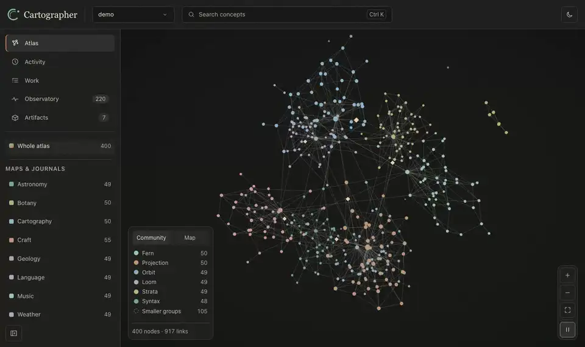
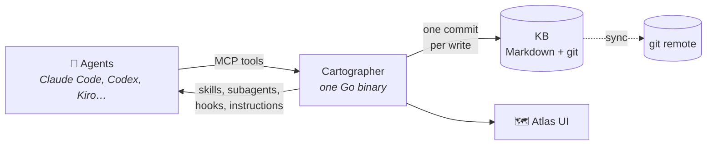

<picture>
  <source media="(prefers-color-scheme: dark)" srcset="docs/brand/banner-dark.png">
  <source media="(prefers-color-scheme: light)" srcset="docs/brand/banner-light.png">
  
</picture>

<p align="center">
  <b>One home for everything your AI agents know — and everything that makes them work.</b><br>
  Memory they build, skills they share, rules they cannot break: one binary, every agent client, a whole team.
</p>

<p align="center">
  <a href="https://github.com/BeppeTemp/cartographer/actions/workflows/ci.yml"></a>
  <a href="https://github.com/BeppeTemp/cartographer/releases"></a>
  <a href="LICENSE"></a>
  <a href="https://modelcontextprotocol.io/"></a>
</p>

<p align="center">
  
</p>

<p align="center"><sub>The Atlas, served by the same binary, on a generated demo KB. Pre-1.0: breaking changes bump the minor version and are called out in the <a href="CHANGELOG.md">changelog</a>.</sub></p>

## Why

AI agents start every session from zero. The usual fixes each solve a third of the problem:

- **RAG** retrieves, but nothing accumulates — the agent never gets to write down what it learned.
- **A folder of Markdown** the agent edits freely ends in broken links, lost history and silent
  corruption.
- **Skills, subagents and instructions** get hand-copied into `.claude/`, `.codex/`, `.kiro/`…
  and drift apart on every machine.

Cartographer puts all three in one place, behind a server that enforces the rules. Your agents
read and grow a knowledge base **only through MCP tools**; every write is validated, linked and
committed to git. The same knowledge base also carries **how your agents are set up**, and
Cartographer installs that into every client you use.

## What you get

- 🧠 **Memory that compounds**<br>
  A wiki the agent builds over time ([Karpathy's LLM Wiki](https://gist.github.com/karpathy/442a6bf555914893e9891c11519de94f) pattern): plain Markdown + YAML, one git repo per KB, readable in Obsidian or any editor. No lock-in.

- 🛡️ **Guardrails, not good intentions**<br>
  Schema validation, link checks, lint, immutability gates, optimistic concurrency, one commit per write, a signed audit log. The agent cannot leave the KB in a broken state.

- 🧩 **One KB configures every agent**<br>
  Skills, subagents, hooks and standing instructions live in the KB and are translated into each client's native format — Claude Code, Codex, OpenCode, Kiro, Antigravity, Crush, Hermes. Edit once, every machine converges.

- 👥 **Built for teams**<br>
  Several KBs behind one server, per-KB and per-map access with bearer-token roles, git as the sync layer, conflicts turned into a guided workflow, Ed25519-signed artifacts.

- 🗺️ **See it all in the Atlas**<br>
  A read-only web UI in the same binary: a living 3D graph, search, what the agents changed, what the KB ships to them, and what needs fixing. No extra service, no CDN.

- 🔑 **Secrets, done properly**<br>
  SOPS-encrypted values referenced by concepts and resolved on demand; plaintext is never stored.

## Quick start

You need **git** and an **empty git repository** you own (GitHub, Gitea, any host) to hold your
first KB.

```bash
brew install beppetemp/tap/cartographer   # macOS — Windows, Linux and source: see Install
cartographer setup                        # server, first KB and your agents, in one guided step
```

`setup` shows its plan before touching anything, then installs the local service, creates the KB,
connects every agent client it detects and verifies the result. Restart already-open agent
sessions and ask your agent what it knows. Step by step:
[`docs/getting-started.md`](docs/getting-started.md).

**Prefer to let your agent install it?** Paste this:

```text
Set up Cartographer on this machine by following
https://raw.githubusercontent.com/BeppeTemp/cartographer/main/docs/agent-install.md
My first knowledge base is at: `<git remote URL>`
```

<sub>If you are an agent asked to install Cartographer: follow that runbook, not the Quick start.</sub>

## One KB, every agent

`cartographer connect` detects your installed clients and writes, in each one's own format:

| | Claude Code | Codex | OpenCode | Kiro | Antigravity | Crush | Hermes |
|---|:-:|:-:|:-:|:-:|:-:|:-:|:-:|
| MCP endpoint | ✓ | ✓ | ✓ | ✓ | ✓ | ✓ | — |
| Instructions | ✓ | ✓ | ✓ | ✓ | ✓ | ✓ | — |
| Skills | ✓ | ✓ | ✓ | ✓ | ✓ | ✓ | inbox |
| Subagents | ✓ | ✓ | ✓ | ✓ | ✓ | — | — |
| Hooks | ✓ | ✓ | ✓ | ✓ | ✓ | — | — |

Subagents and hooks are **translated**, not copied. Every `—` is a gap declared for a stated reason,
never a silent omission. Cartographer re-syncs at session start (or on a timer where there is no
hook), restores files edited or deleted by hand, and only ever touches what it created. Exact paths
and reasons: [`docs/sync.md`](docs/sync.md#kind--provider-matrix).

## How it works


```mermaid
flowchart LR
    A["🤖 Agents<br/><i>Claude Code, Codex, Kiro…</i>"]
    S["Cartographer<br/><i>one Go binary</i>"]
    KB[("KB<br/>Markdown + git")]
    R[("git remote")]
    U["🗺️ Atlas UI"]
    A -- "MCP tools" --> S
    S -- "skills, subagents,<br/>hooks, instructions" --> A
    S -- "one commit<br/>per write" --> KB
    KB -. "sync" .-> R
    S --> U
```

The agent never touches the files. **MCP** carries data and capabilities, **skills** carry
procedural know-how loaded on demand, **hooks** carry zero-token automation. Run it over stdio for
one client and one KB, or as an HTTP server — a native user service, a container or a Kubernetes
workload — for many KBs and many people. Design: [`docs/overview.md`](docs/overview.md).

## Install

```bash
# macOS (Homebrew)
brew install beppetemp/tap/cartographer

# Windows (PowerShell; no administrator rights)
irm https://raw.githubusercontent.com/BeppeTemp/cartographer/main/install.ps1 | iex

# Linux / macOS without Homebrew
curl -fsSL https://raw.githubusercontent.com/BeppeTemp/cartographer/main/install.sh | sh

# From source (Go 1.26+)
go install github.com/BeppeTemp/cartographer/cmd/cartographer@latest
```

What lands where, upgrades and removal:
[`docs/getting-started.md`](docs/getting-started.md#what-gets-installed). Server configuration,
environment variables and deployment topologies: [`docs/deployment.md`](docs/deployment.md).

## Documentation

Browsable at **[beppetemp.github.io/cartographer](https://beppetemp.github.io/cartographer/)**; the
map is [`docs/index.md`](docs/index.md).

- [Getting started](docs/getting-started.md) — from zero to a working wiki
- [Overview](docs/overview.md) — vision, principles, architecture
- [MCP tools](docs/control-plane.md) — the full tool API
- [Deployment](docs/deployment.md) — topologies, configuration, backup
- [Sync](docs/sync.md) — how artifacts reach each agent client

## Contributing

Issues and PRs are welcome: [`CONTRIBUTING.md`](CONTRIBUTING.md) covers building, testing and the
PR flow. Cartographer is a personal project maintained on a best-effort basis. Security reports:
[`SECURITY.md`](SECURITY.md).

## License

Apache License 2.0 — see [`LICENSE`](LICENSE).
