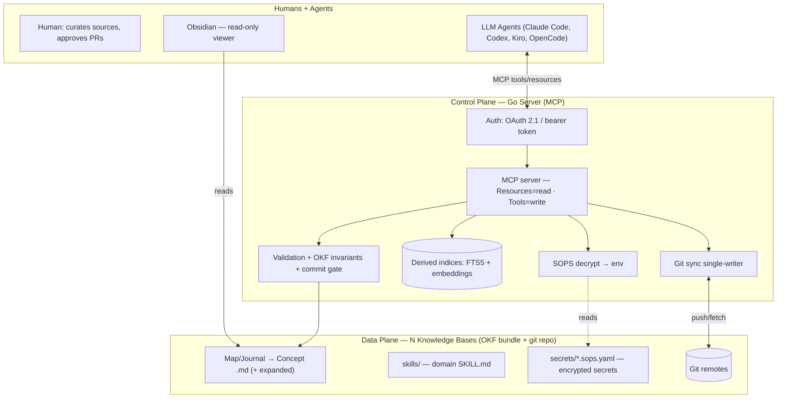

# Cartographer — vision and general architecture

## What it is

**General-purpose agentic wiki**: a knowledge base guided by an LLM agent, independent of the client used and customizable in its content. Designed to work both locally (single agent, process alongside the files) and as a containerized server serving multiple agents and multiple independent KBs.

It rests on two complementary pillars:

- **Karpathy's "LLM Wiki" pattern** — operating model. The agent *builds and maintains* a persistent wiki of interconnected Markdown files, enriching it with every source. Knowledge composes over time (it is not stateless RAG).
- **Google Cloud's Open Knowledge Format (OKF v0.1)** — standard substrate. A folder of `.md` files with YAML frontmatter; each file is a concept identified by its path. Makes the wiki readable by any tool with no lock-in.

**Thesis:** the Karpathy loop (ingest → query → lint) on top of an OKF substrate, mediated by a **Go server exposing an MCP**. The agent never touches the files directly: it operates through the server, which enforces the invariants.

## Two product profiles

| Profile | When | Characteristics |
|---|---|---|
| **Local Core (v1)** | Single user / local agent | Stdio, local git, lightweight gate, no OAuth, no SOPS. Captures the value of the Karpathy pattern. |
| **Server (add-on)** | Multi-agent, containerized | Streamable HTTP + OAuth, per-KB scope, full git sync, semantic embedding, skills/services/SOPS secrets, PR-based ingest. |

Server complexity is **opt-in**: every additional capability is disabled in the Local Core.

## Guiding principles

1. **Provenance is tracked.** Every derived concept declares its sources (`provenance` + `# Citations`).
2. **The agent owns and maintains the wiki; you curate.**
3. **The schema is a contract, not a suggestion.**
4. **Knowledge composes.** Good answers get trimmed into the wiki as new concepts.
5. **The path is the identity.** The concept ID is the file path (without `.md`).
6. **Only one required field: `type`.** Everything else is optional.
7. **Links are untyped edges of a graph.** The relationship is given by the prose.
8. **Permissive consumption.** Broken links, unknown fields, unrecognized types are tolerated.
9. **Maintenance ≈ 0.** The wiki stays alive because maintaining it costs almost nothing.
10. **Separation of policy / representation.** Hard rules in the Go server; representation in the files.
11. **Vault = truth, index = disposable.** Every index is derived and regenerable from the files.
12. **Domain neutrality.** Archives, types and the contract are user-configurable.
13. **Surface, not silence.** Faced with conflicting sources, the wiki exposes the tension with provenance, without picking a side.
14. **Never secrets in plaintext.** Only logical variable names; values encrypted with SOPS.
15. **Human-on-the-loop on writes.** Lightweight gate in Core, PR in Server.

## General architecture

**Central rule:** *the file system is the truth.* The server only holds regenerable derived indices. Deleting the entire server state and rebuilding it from just the `.md` files + `git` must always be possible.

## Two planes

| Plane | What it is | Responsibility |
|---|---|---|
| **Data Plane** | KB (Atlas): MD files (Map/Journal → Concept) + skills + services + secrets | Source of truth. Plain text, versionable, portable. |
| **Control Plane** | Go server implementing an MCP | Guardian and interface. Enforces rules, validates, indexes, exposes the operations. Holds no critical state. |

## Technology stack

| Component | Technology | Role |
|---|---|---|
| Data plane | `.md` files + YAML, OKF v0.1 | Source of truth |
| Versioning + sync | git (single-writer, rebase+retry) | History, diff, backup |
| Governance server | **Go** | Guardian + API |
| Protocol | **MCP** — Streamable HTTP (server) / stdio (local) | Agnostic interface |
| Authentication | **OAuth 2.1** resource-server / bearer token | Agent ↔ server boundary |
| Packaging / deploy | **Docker** | Distribution |
| Keyword index | in-memory inverted index (pure Go) | Keyword search (Core) |
| Semantic index | Embedding vectors (Ollama) | Similarity (Server) |
| Skill | **SKILL.md** (agentskills.io) | Installable domain procedures |
| Services | `type: Service` concept | External connection descriptors |
| Secrets | **SOPS** (≥3.13) + **age** | Versioned encrypted secrets |
| Human viewer | Obsidian | Reading, graph, Dataview |
| Configurator | Dedicated tool + TUI (source-of-truth → adapter) | Max-capability MCP/skill/hook config |
| Provider | Claude Code, Codex, Kiro, OpenCode | Ingest / query / lint |
