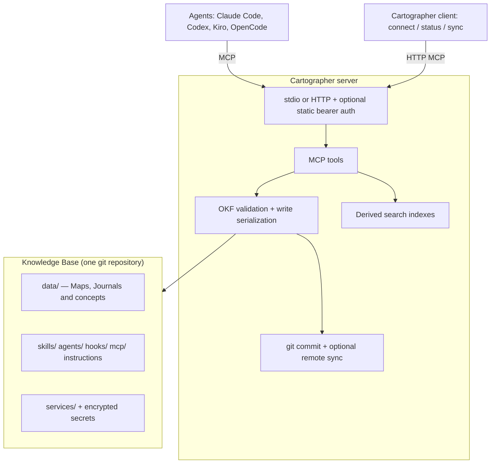

# Cartographer — architecture

## What it is

Cartographer is a general-purpose agentic wiki: an MCP server that lets agents
build and maintain Git-versioned knowledge bases without writing their files
directly.

It combines two ideas:

- Karpathy's LLM Wiki pattern: useful knowledge compounds in a persistent,
  linked wiki instead of disappearing with a chat session.
- Google's Open Knowledge Format (OKF): concepts are portable Markdown files
  with YAML frontmatter, identified by their path.

The filesystem and git history are the source of truth. Search databases and
in-memory graphs are derived state and can be rebuilt.

## Runtime shapes

The same binary supports two transports:

| Shape | Command | Intended use |
|---|---|---|
| Local stdio | `cartographer serve --kb <path>` | One local client connected to one KB |
| HTTP server | `cartographer serve --config <file>` | One or more KBs, remote clients, optional static bearer authorization |

HTTP can be run as a native user service, a container or a Kubernetes
workload. These are deployment choices, not separate product profiles: the KB
model and MCP tools are the same.

## Principles

1. The agent uses MCP tools; the server owns filesystem writes and validation.
2. Concept paths are stable identities.
3. Markdown and git remain portable and inspectable without Cartographer.
4. Unknown frontmatter and types are tolerated unless a documented invariant
   requires otherwise.
5. Search and indexes are disposable projections of the files.
6. Writes use optimistic concurrency and one git commit per logical operation.
7. One server process is the writer for a mounted working copy.
8. Domain structure and concept types belong to the KB, not the application.
9. Secrets remain encrypted at rest and are resolved only when explicitly
   requested.

## Components

```mermaid
flowchart TB
    A["Agents: Claude Code, Codex, Kiro, OpenCode"]
    C["Cartographer client: connect / status / sync"]

    subgraph S["Cartographer server"]
        T["stdio or HTTP + optional static bearer auth"]
        M["MCP tools"]
        V["OKF validation + write serialization"]
        I["Derived search indexes"]
        G["git commit + optional remote sync"]
    end

    subgraph K["Knowledge Base (one git repository)"]
        D["data/ — Maps, Journals and concepts"]
        P["skills/ agents/ hooks/ mcp/ instructions"]
        X["services/ + encrypted secrets"]
    end

    A -->|MCP| T --> M
    C -->|HTTP MCP| T
    M --> V --> K
    M --> I
    V --> G
```

## Where to continue

- [Data plane](data-plane.md): KB layout, concept model, and non-Markdown dossier assets.
- [Control plane](control-plane.md): complete MCP tool surface.
- [Transport and authorization](transport-auth.md): stdio, HTTP and scopes.
- [Concurrency](concurrency.md): commits, remote sync and conflicts.
- [Configurator](configurator.md) and [synchronization](sync.md): client-side
  provider setup and provisioned artifacts.
- [Decision records](decisions.md): historical rationale, split by topic.
